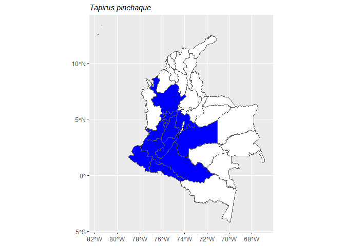

<!-- README.md is generated from README.Rmd. Please edit that file -->

# mammalcol 

<!-- badges: start -->

[](https://github.com/dlizcano/mammalcol/actions/workflows/R-CMD-check.yaml)
[](https://app.codecov.io/gh/dlizcano/mammalcol?branch=main)
[](https://CRAN.R-project.org/package=mammalcol)
[](https://lifecycle.r-lib.org/articles/stages.html#stable)
[](https://github.com/dlizcano/mammalcol)
<!-- badges: end -->

The goal of mammalcol is to allow easy access to the List of Mammal
Species of Colombia.

Researchers can explore Colombia’s amazing variety of mammals using the
mammalcol R package. This package includes information on 548 mammal
species, making Colombia one of the world leaders in mammal diversity.
The data comes from the latest “Checklist of the mammals (Mammalia) of
Colombia” by [Ramírez-Chaves et al
(2021)](https://doi.org/10.47603/mano.v7n2.253). But It’s important to
remember that how scientists classify mammals keeps changing constantly,
so the information in this package has been updated with the checklist
[Mamíferos de Colombia](https://doi.org/10.15472/kl1whs), which is
published and updated regularly by the Colombian Mammal Society.

## Installation

You can install the development version of mammalcol from
[GitHub](https://github.com/dlizcano/mammalcol) with:

``` r
# install.packages("devtools")
devtools::install_github("dlizcano/mammalcol")
```

## load library

``` r

library(mammalcol)
#> This is mammalcol 0.2.3
#> 
#> Adjuntando el paquete: 'mammalcol'
#> The following objects are masked _by_ '.GlobalEnv':
#> 
#>     colmap, distribution, mamm_coords_validator, mammalmap,
#>     search_mammalcol, sp_by_depto, taxon
```

## Example

### Search database

This is a basic example which shows you how to search mammal names in
Colombia using a vector of mammal names.

``` r
# define a vector with species to search for
splist <- c(
  "Tapirus bairdii", "Tapirus pinchaque", "Tapirus terrestris",
  "Tapirus terrestris", "Pudu mephistophiles", "Tapirus bairdii"
)

# search in database
search_mammalcol(splist)
#> The following names are repeated in the 'splist': Tapirus bairdii, Tapirus terrestris
#>        name_submitted
#> 1     Tapirus bairdii
#> 2   Tapirus pinchaque
#> 3  Tapirus terrestris
#> 4 Pudu mephistophiles
#>                                                                               taxonID
#> 1                                                            gbif.org/species/2440897
#> 2 urn:lsid:catalogueoflife.org:taxon:4f2010e3-5e17-11e7-8cee-bc764e092680:col20170824
#> 3 urn:lsid:catalogueoflife.org:taxon:4f200f4b-5e17-11e7-8cee-bc764e092680:col20170824
#> 4 urn:lsid:catalogueoflife.org:taxon:4f167916-5e17-11e7-8cee-bc764e092680:col20170824
#>                                                                       scientificNameID
#> 1                                                 https://www.gbif.org/species/2440897
#> 2 http://www.itis.gov/servlet/SingleRpt/SingleRpt?search_topic=TSN&search_value=624999
#> 3 http://www.itis.gov/servlet/SingleRpt/SingleRpt?search_topic=TSN&search_value=625000
#> 4 http://www.itis.gov/servlet/SingleRpt/SingleRpt?search_topic=TSN&search_value=625074
#>        scientificName
#> 1     Tapirus bairdii
#> 2   Tapirus pinchaque
#> 3  Tapirus terrestris
#> 4 Pudu mephistophiles
#>                                                                                                                                                                                                                                                                                                                                                                                                                                                                                   nameAccordingTo
#> 1                                                                                                                                                                                                                                                                                                                         Tapirus bairdii (Gill, 1865) in GBIF Secretariat (2017). GBIF Backbone Taxonomy. Checklist dataset https://doi.org/10.15468/39omei accessed via GBIF.org on 2019-08-01.
#> 2 Tom Orrell (custodian), Dave Nicolson (ed). (2019). ITIS Global: The Integrated Taxonomic Information System (version Jun 2017). In: Species 2000 & ITIS Catalogue of Life, 2019 Annual Checklist (Roskov Y., Ower G., Orrell T., Nicolson D., Bailly N., Kirk P.M., Bourgoin T., DeWalt R.E., Decock W., Nieukerken E. van, Zarucchi J., Penev L., eds.). Digital resource at www.catalogueoflife.org/annual-checklist/2019. Species 2000: Naturalis, Leiden, the Netherlands. ISSN 2405-884X.
#> 3 Tom Orrell (custodian), Dave Nicolson (ed). (2019). ITIS Global: The Integrated Taxonomic Information System (version Jun 2017). In: Species 2000 & ITIS Catalogue of Life, 2019 Annual Checklist (Roskov Y., Ower G., Orrell T., Nicolson D., Bailly N., Kirk P.M., Bourgoin T., DeWalt R.E., Decock W., Nieukerken E. van, Zarucchi J., Penev L., eds.). Digital resource at www.catalogueoflife.org/annual-checklist/2019. Species 2000: Naturalis, Leiden, the Netherlands. ISSN 2405-884X.
#> 4 Tom Orrell (custodian), Dave Nicolson (ed). (2019). ITIS Global: The Integrated Taxonomic Information System (version Jun 2017). In: Species 2000 & ITIS Catalogue of Life, 2019 Annual Checklist (Roskov Y., Ower G., Orrell T., Nicolson D., Bailly N., Kirk P.M., Bourgoin T., DeWalt R.E., Decock W., Nieukerken E. van, Zarucchi J., Penev L., eds.). Digital resource at www.catalogueoflife.org/annual-checklist/2019. Species 2000: Naturalis, Leiden, the Netherlands. ISSN 2405-884X.
#>    kingdom   phylum    class          order    family   genus specificEpithet
#> 1 Animalia Chordata Mammalia Perissodactyla Tapiridae Tapirus         bairdii
#> 2 Animalia Chordata Mammalia Perissodactyla Tapiridae Tapirus       pinchaque
#> 3 Animalia Chordata Mammalia Perissodactyla Tapiridae Tapirus      terrestris
#> 4 Animalia Chordata Mammalia   Artiodactyla  Cervidae    Pudu  mephistophiles
#>   taxonRank scientificNameAuthorship taxonomicStatus             taxonRemarks
#> 1   Especie             (Gill, 1865)          Válido    Elevación (m): 0-1000
#> 2   Especie           (Roulin, 1829)          Válido Elevación (m): 1400-4000
#> 3   Especie         (Linnaeus, 1758)          Válido    Elevación (m): 0-2400
#> 4   Especie        (de Winton, 1896)          Válido Elevación (m): 3000-3500
#>   language                         rightsHolder
#> 1       es Sociedad Colombiana de Mastozoología
#> 2       es Sociedad Colombiana de Mastozoología
#> 3       es Sociedad Colombiana de Mastozoología
#> 4       es Sociedad Colombiana de Mastozoología
#>                                                                                                                                                                                                                                                           bibliographicCitation
#> 1                                                              HERSHKOVITZ P. 1954. Mammals of northern Colombia. Preliminary report No. 7: Tapirs (genus Tapirus), with a systematic review of American species. Proceedings of the United States National Museum 103:465-496.
#> 2                                                              ARIAS-ALZATE A, CC DOWNER, C DELGADO-V y J SÁNCHEZ-LONDOÑO. 2010. Un registro de tapir de montaña (Tapirus pinchaque) en el norte de la Cordillera Occidental de Colombia. Mastozoología Neotropical 17:111-116.
#> 3 ARIAS-ALZATE A, JA PALACIO VIEIRA y J MUÑOZ-DURAN. 2009. Nuevos registros de distribución y oferta de hábitat de la danta colombiana (Tapirus terrestris colombianus) en las tierras bajas del norte de la Cordillera Central (Colombia). Mastozoología Neotropical 16:19-25.
#> 4                                                                                                                                        ALBERICO M, A CADENA, JI HERNÁNDEZ-CAMACHO y Y MUÑOZ-SABA. 2000b. Mamíferos (Synapsida: Theria) de Colombia. Biota Colombiana 1:43-75.
#>   inMDD                                 Col_redlist
#> 1     1 EN A2cd+ B1ab (i,ii,iii)+ B2ab (i, ii, iii)
#> 2     1                                     EN A4cd
#> 3     1                                     VU A4cd
#> 4     1         EN A2cd B1ab (i; ii; iii; iv; v) \n
#>                                                                                                                                                                           distribution
#> 1                                                                                                                                                          Antioquia | Chocó | Córdoba
#> 2                                              Antioquia | Cauca | Cundinamarca | Huila | Meta | Nariño | Quindío | Risaralda | Tolima | Valle del Cauca | Caldas | Caquetá | Putumayo
#> 3 Antioquia | Amazonas | Arauca | Caquetá | Cauca | Cesar | Córdoba | Guainía | La Guajira | Meta | Magdalena | Vaupés | Vichada | Guaviare | Casanare | Norte de Santander | Putumayo
#> 4                                                                                                              Cauca | Huila | Nariño | Risaralda | Quindío | Tolima | Valle del Cauca
#>                                                         source endemic
#> 1 Proceedings of the United States National Museum 103:465-496      No
#> 2                         Mastozoología Neotropical 17:111-116      No
#> 3                           Mastozoología Neotropical 16:19-25      No
#> 4                                     Biota Colombiana 1:43-75      No
#>             english_name Distance
#> 1 Central American Tapir       21
#> 2         Mountain Tapir       77
#> 3          Lowland Tapir       78
#> 4          Northern Pudu       77
```

#### Search database with typos

`mammalcol` has the ability to identify and correct minor typos and
lower case in the genus. Correcting potential typos or variations in
species names through fuzzy matching is a crucial aspect of data
management. This technique ensures precise retrieval by adeptly
identifying and accommodating minor differences in input names, thus
enhancing the reliability of analyses conducted on diverse,
inconsistent, and ensemble data sets.

``` r
# vector with species names and intentional typos
splist <- c("Tapiru terrestre", "pudu mephistophiles", "tapirus bairdii")

# search in database
search_mammalcol(splist)
#>        name_submitted
#> 1    Tapiru terrestre
#> 2 Pudu mephistophiles
#> 3     Tapirus bairdii
#>                                                                               taxonID
#> 1 urn:lsid:catalogueoflife.org:taxon:4f200f4b-5e17-11e7-8cee-bc764e092680:col20170824
#> 2 urn:lsid:catalogueoflife.org:taxon:4f167916-5e17-11e7-8cee-bc764e092680:col20170824
#> 3                                                            gbif.org/species/2440897
#>                                                                       scientificNameID
#> 1 http://www.itis.gov/servlet/SingleRpt/SingleRpt?search_topic=TSN&search_value=625000
#> 2 http://www.itis.gov/servlet/SingleRpt/SingleRpt?search_topic=TSN&search_value=625074
#> 3                                                 https://www.gbif.org/species/2440897
#>        scientificName
#> 1  Tapirus terrestris
#> 2 Pudu mephistophiles
#> 3     Tapirus bairdii
#>                                                                                                                                                                                                                                                                                                                                                                                                                                                                                   nameAccordingTo
#> 1 Tom Orrell (custodian), Dave Nicolson (ed). (2019). ITIS Global: The Integrated Taxonomic Information System (version Jun 2017). In: Species 2000 & ITIS Catalogue of Life, 2019 Annual Checklist (Roskov Y., Ower G., Orrell T., Nicolson D., Bailly N., Kirk P.M., Bourgoin T., DeWalt R.E., Decock W., Nieukerken E. van, Zarucchi J., Penev L., eds.). Digital resource at www.catalogueoflife.org/annual-checklist/2019. Species 2000: Naturalis, Leiden, the Netherlands. ISSN 2405-884X.
#> 2 Tom Orrell (custodian), Dave Nicolson (ed). (2019). ITIS Global: The Integrated Taxonomic Information System (version Jun 2017). In: Species 2000 & ITIS Catalogue of Life, 2019 Annual Checklist (Roskov Y., Ower G., Orrell T., Nicolson D., Bailly N., Kirk P.M., Bourgoin T., DeWalt R.E., Decock W., Nieukerken E. van, Zarucchi J., Penev L., eds.). Digital resource at www.catalogueoflife.org/annual-checklist/2019. Species 2000: Naturalis, Leiden, the Netherlands. ISSN 2405-884X.
#> 3                                                                                                                                                                                                                                                                                                                         Tapirus bairdii (Gill, 1865) in GBIF Secretariat (2017). GBIF Backbone Taxonomy. Checklist dataset https://doi.org/10.15468/39omei accessed via GBIF.org on 2019-08-01.
#>    kingdom   phylum    class          order    family   genus specificEpithet
#> 1 Animalia Chordata Mammalia Perissodactyla Tapiridae Tapirus      terrestris
#> 2 Animalia Chordata Mammalia   Artiodactyla  Cervidae    Pudu  mephistophiles
#> 3 Animalia Chordata Mammalia Perissodactyla Tapiridae Tapirus         bairdii
#>   taxonRank scientificNameAuthorship taxonomicStatus             taxonRemarks
#> 1   Especie         (Linnaeus, 1758)          Válido    Elevación (m): 0-2400
#> 2   Especie        (de Winton, 1896)          Válido Elevación (m): 3000-3500
#> 3   Especie             (Gill, 1865)          Válido    Elevación (m): 0-1000
#>   language                         rightsHolder
#> 1       es Sociedad Colombiana de Mastozoología
#> 2       es Sociedad Colombiana de Mastozoología
#> 3       es Sociedad Colombiana de Mastozoología
#>                                                                                                                                                                                                                                                           bibliographicCitation
#> 1 ARIAS-ALZATE A, JA PALACIO VIEIRA y J MUÑOZ-DURAN. 2009. Nuevos registros de distribución y oferta de hábitat de la danta colombiana (Tapirus terrestris colombianus) en las tierras bajas del norte de la Cordillera Central (Colombia). Mastozoología Neotropical 16:19-25.
#> 2                                                                                                                                        ALBERICO M, A CADENA, JI HERNÁNDEZ-CAMACHO y Y MUÑOZ-SABA. 2000b. Mamíferos (Synapsida: Theria) de Colombia. Biota Colombiana 1:43-75.
#> 3                                                              HERSHKOVITZ P. 1954. Mammals of northern Colombia. Preliminary report No. 7: Tapirs (genus Tapirus), with a systematic review of American species. Proceedings of the United States National Museum 103:465-496.
#>   inMDD                                 Col_redlist
#> 1     1                                     VU A4cd
#> 2     1         EN A2cd B1ab (i; ii; iii; iv; v) \n
#> 3     1 EN A2cd+ B1ab (i,ii,iii)+ B2ab (i, ii, iii)
#>                                                                                                                                                                           distribution
#> 1 Antioquia | Amazonas | Arauca | Caquetá | Cauca | Cesar | Córdoba | Guainía | La Guajira | Meta | Magdalena | Vaupés | Vichada | Guaviare | Casanare | Norte de Santander | Putumayo
#> 2                                                                                                              Cauca | Huila | Nariño | Risaralda | Quindío | Tolima | Valle del Cauca
#> 3                                                                                                                                                          Antioquia | Chocó | Córdoba
#>                                                         source endemic
#> 1                           Mastozoología Neotropical 16:19-25      No
#> 2                                     Biota Colombiana 1:43-75      No
#> 3 Proceedings of the United States National Museum 103:465-496      No
#>             english_name Distance
#> 1          Lowland Tapir       76
#> 2          Northern Pudu       77
#> 3 Central American Tapir       21
```

### Produce a map

The function mammalmap produces basic a map of distribution at the
“Departamento” level for a single species.

``` r
# write a species name in the function to map it
mammalmap("Tapirus pinchaque")
```


#### Remove the legend

Using the parameter legend=FALSE

``` r
# write a species name in the function to map it
mammalmap("Tapirus pinchaque", legend=FALSE)
```



### See the full taxon table

``` r

head(taxon)
#>                                                                                    id
#> 1                                             urn:lsid:organismnames.com:name:3484299
#> 2 urn:lsid:catalogueoflife.org:taxon:4f16759f-5e17-11e7-8cee-bc764e092680:col20170824
#> 3                                                eol.org/pages/Mazama%20sanctaemartae
#> 4 urn:lsid:catalogueoflife.org:taxon:259114ac-5e17-11e7-8cee-bc764e092680:col20170824
#> 5                                             urn:lsid:organismnames.com:name:3484302
#> 6                                             urn:lsid:organismnames.com:name:3535811
#>                                                                               taxonID
#> 1                                             urn:lsid:organismnames.com:name:3484299
#> 2 urn:lsid:catalogueoflife.org:taxon:4f16759f-5e17-11e7-8cee-bc764e092680:col20170824
#> 3                                                eol.org/pages/Mazama%20sanctaemartae
#> 4 urn:lsid:catalogueoflife.org:taxon:259114ac-5e17-11e7-8cee-bc764e092680:col20170824
#> 5                                             urn:lsid:organismnames.com:name:3484302
#> 6                                             urn:lsid:organismnames.com:name:3535811
#>                                                                       scientificNameID
#> 1 http://www.itis.gov/servlet/SingleRpt/SingleRpt?search_topic=TSN&search_value=898446
#> 2 http://www.itis.gov/servlet/SingleRpt/SingleRpt?search_topic=TSN&search_value=625072
#> 3 http://www.itis.gov/servlet/SingleRpt/SingleRpt?search_topic=TSN&search_value=898449
#> 4 http://www.itis.gov/servlet/SingleRpt/SingleRpt?search_topic=TSN&search_value=898202
#> 5 http://www.itis.gov/servlet/SingleRpt/SingleRpt?search_topic=TSN&search_value=898440
#> 6                                                 https://www.gbif.org/species/8872400
#>             scientificName
#> 1       Passalites murelia
#> 2            Mazama rufina
#> 3 Passalites sanctaemartae
#> 4            Mazama temama
#> 5            Mazama zamora
#> 6             Mazama zetta
#>                                                                                                                                                                                                                                                                                                                                                                                                                                                                                   nameAccordingTo
#> 1 Tom Orrell (custodian), Dave Nicolson (ed). (2019). ITIS Global: The Integrated Taxonomic Information System (version Jun 2017). In: Species 2000 & ITIS Catalogue of Life, 2019 Annual Checklist (Roskov Y., Ower G., Orrell T., Nicolson D., Bailly N., Kirk P.M., Bourgoin T., DeWalt R.E., Decock W., Nieukerken E. van, Zarucchi J., Penev L., eds.). Digital resource at www.catalogueoflife.org/annual-checklist/2019. Species 2000: Naturalis, Leiden, the Netherlands. ISSN 2405-884X.
#> 2 Tom Orrell (custodian), Dave Nicolson (ed). (2019). ITIS Global: The Integrated Taxonomic Information System (version Jun 2017). In: Species 2000 & ITIS Catalogue of Life, 2019 Annual Checklist (Roskov Y., Ower G., Orrell T., Nicolson D., Bailly N., Kirk P.M., Bourgoin T., DeWalt R.E., Decock W., Nieukerken E. van, Zarucchi J., Penev L., eds.). Digital resource at www.catalogueoflife.org/annual-checklist/2019. Species 2000: Naturalis, Leiden, the Netherlands. ISSN 2405-884X.
#> 3 Tom Orrell (custodian), Dave Nicolson (ed). (2019). ITIS Global: The Integrated Taxonomic Information System (version Jun 2017). In: Species 2000 & ITIS Catalogue of Life, 2019 Annual Checklist (Roskov Y., Ower G., Orrell T., Nicolson D., Bailly N., Kirk P.M., Bourgoin T., DeWalt R.E., Decock W., Nieukerken E. van, Zarucchi J., Penev L., eds.). Digital resource at www.catalogueoflife.org/annual-checklist/2019. Species 2000: Naturalis, Leiden, the Netherlands. ISSN 2405-884X.
#> 4 Tom Orrell (custodian), Dave Nicolson (ed). (2019). ITIS Global: The Integrated Taxonomic Information System (version Jun 2017). In: Species 2000 & ITIS Catalogue of Life, 2019 Annual Checklist (Roskov Y., Ower G., Orrell T., Nicolson D., Bailly N., Kirk P.M., Bourgoin T., DeWalt R.E., Decock W., Nieukerken E. van, Zarucchi J., Penev L., eds.). Digital resource at www.catalogueoflife.org/annual-checklist/2019. Species 2000: Naturalis, Leiden, the Netherlands. ISSN 2405-884X.
#> 5 Tom Orrell (custodian), Dave Nicolson (ed). (2019). ITIS Global: The Integrated Taxonomic Information System (version Jun 2017). In: Species 2000 & ITIS Catalogue of Life, 2019 Annual Checklist (Roskov Y., Ower G., Orrell T., Nicolson D., Bailly N., Kirk P.M., Bourgoin T., DeWalt R.E., Decock W., Nieukerken E. van, Zarucchi J., Penev L., eds.). Digital resource at www.catalogueoflife.org/annual-checklist/2019. Species 2000: Naturalis, Leiden, the Netherlands. ISSN 2405-884X.
#> 6                                                                                                                                                                                                                                                                                                                            Mazama zetta Thomas, 1913 in GBIF Secretariat (2017). GBIF Backbone Taxonomy. Checklist dataset https://doi.org/10.15468/39omei accessed via GBIF.org on 2019-08-01.
#>    kingdom   phylum    class        order   family      genus specificEpithet
#> 1 Animalia Chordata Mammalia Artiodactyla Cervidae Passalites         murelia
#> 2 Animalia Chordata Mammalia Artiodactyla Cervidae     Mazama          rufina
#> 3 Animalia Chordata Mammalia Artiodactyla Cervidae Passalites   sanctaemartae
#> 4 Animalia Chordata Mammalia Artiodactyla Cervidae     Mazama          temama
#> 5 Animalia Chordata Mammalia Artiodactyla Cervidae     Mazama          zamora
#> 6 Animalia Chordata Mammalia Artiodactyla Cervidae     Mazama           zetta
#>   taxonRank scientificNameAuthorship taxonomicStatus             taxonRemarks
#> 1   Especie        J. A. Allen, 1915          Válido     Elevación (m): 0-900
#> 2   Especie         (Pucheran, 1851)          Válido Elevación (m): 1500-4000
#> 3   Especie      (J. A. Allen, 1915)          Válido     Elevación (m): 0-900
#> 4   Especie             (Kerr, 1792)          Válido      Elevación (m): 0-68
#> 5   Especie        J. A. Allen, 1915          Válido  Elevación (m): 600-1200
#> 6   Especie             Thomas, 1913          Válido Elevación (m): 1600-1950
#>   language                         rightsHolder
#> 1       es Sociedad Colombiana de Mastozoología
#> 2       es Sociedad Colombiana de Mastozoología
#> 3       es Sociedad Colombiana de Mastozoología
#> 4       es Sociedad Colombiana de Mastozoología
#> 5       es Sociedad Colombiana de Mastozoología
#> 6       es Sociedad Colombiana de Mastozoología
#>                                                                                                                                                                    bibliographicCitation
#> 1 ALLEN JA. 1916. List of mammals collected in Colombia by the American Museum of Natural History expeditions, 1910-1915. Bulletin of the American Museum of Natural History 35:191-238.
#> 2                                                 ALBERICO M, A CADENA, JI HERNÁNDEZ-CAMACHO y Y MUÑOZ-SABA. 2000b. Mamíferos (Synapsida: Theria) de Colombia. Biota Colombiana 1:43-75.
#> 3 ALLEN JA. 1916. List of mammals collected in Colombia by the American Museum of Natural History expeditions, 1910-1915. Bulletin of the American Museum of Natural History 35:191-238.
#> 4  GROVES C y P GRUBB. 1987. Relationships of living deer. Pp. 21-59, en: Biology and management of the Cervidae (CM Wemmer, ed.). Smithsonian Institution Press, Washington, D.C., USA.
#> 5 ALLEN JA. 1916. List of mammals collected in Colombia by the American Museum of Natural History expeditions, 1910-1915. Bulletin of the American Museum of Natural History 35:191-238.
#> 6 ALLEN JA. 1916. List of mammals collected in Colombia by the American Museum of Natural History expeditions, 1910-1915. Bulletin of the American Museum of Natural History 35:191-238.
#>   inMDD Col_redlist
#> 1     0        <NA>
#> 2     1 VU A2 cde\n
#> 3     0        <NA>
#> 4     1          DD
#> 5     0          DD
#> 6     0          DD
#>                                                                                                                                                              distribution
#> 1                                                                                 Amazonas | Caquetá | Cauca | Meta | Vaupés | Vichada | Nariño | Putumayo | Cundinamarca
#> 2 Antioquia | Boyacá | Caldas | Cauca | Cesar | Cundinamarca | Huila | Nariño | Norte de Santander | Quindío | Risaralda | Santander | Tolima | Valle del Cauca | Caquetá
#> 3                                                                                           Bolívar | Cesar | La Guajira | Magdalena | Atlántico | Córdoba | Cundinamarca
#> 4                                                                                                                                                       Chocó | Magdalena
#> 5                                                                                                                          Amazonas | Caquetá | Meta | Putumayo | Vichada
#> 6                                                                                                          Antioquia | Caldas | Cauca | Nariño | Valle del Cauca | Tolima
#>                                                                                                                         source
#> 1                                                                Bulletin of the American Museum of Natural History 35:191-238
#> 2                                                                                                     Biota Colombiana 1:43-75
#> 3                                                                Bulletin of the American Museum of Natural History 35:191-238
#> 4 Pp. 21-59, en: Biology and management of the Cervidae (CM Wemmer, ed.). Smithsonian Institution Press, Washington, D.C., USA
#> 5                                                                Bulletin of the American Museum of Natural History 35:191-238
#> 6                                                                Bulletin of the American Museum of Natural History 35:191-238
#>   endemic        english_name
#> 1      No                <NA>
#> 2      No  Little Red Brocket
#> 3      No                <NA>
#> 4      No Mexican Red Brocket
#> 5      No                <NA>
#> 6      No                <NA>
```

### Search mammals present by departamento

Use the departamento name or a vector of departamentos to know the
mammals species present. The argument type = “any” retrieve mammals
present in any of those departamentos.

``` r
occ.any <- sp_by_depto(c("Arauca", "Norte de Santander"), type = "any")
head(occ.any)
#>          scientificName         family        order
#> 1   Vampyressa voragine Phyllostomidae   Chiroptera
#> 2   Odocoileus goudotii       Cervidae Artiodactyla
#> 3       Chilomys fumeus     Cricetidae     Rodentia
#> 4 Melanomys columbianus     Cricetidae     Rodentia
#> 5        Tonatia maresi Phyllostomidae   Chiroptera
#> 6     Coendou pruinosus Erethizontidae     Rodentia
#>                                                                                         locality
#> 1                                                                  Casanare | Norte de Santander
#> 2                                         Boyacá | Cundinamarca | Santander | Norte de Santander
#> 3                                                                             Norte de Santander
#> 4                                                                 Magdalena | Norte de Santander
#> 5 Amazonas | Caquetá | Casanare | Huila | Meta | Putumayo | Vaupés | Guaviare | Arauca | Guainía
#> 6               Cundinamarca | Norte de Santander | Santander | Guainía | Meta | Arauca | Tolima
```

The argument type = “only” retrieves species present only in that
departamento and in no other departamento.

``` r
occ.only <- sp_by_depto(c("Norte de Santander"), type = "only")
head(occ.only)
#>    scientificName     family    order           locality
#> 1 Chilomys fumeus Cricetidae Rodentia Norte de Santander
```

The argument all retrieves species present in both departamentos. The
argument taxa limit the search to one order. occ.bats has the bats
present in Arauca and Norte de Santander.

``` r
occ.all <- sp_by_depto(c("Arauca", "Norte de Santander"), type = "all")
occ.bats <- sp_by_depto(c("Arauca", "Norte de Santander"), type = "all", taxa = "Chiroptera")
head(occ.bats)
#>           scientificName         family      order
#> 1     Dermanura phaeotis Phyllostomidae Chiroptera
#> 2         Molossus rufus     Molossidae Chiroptera
#> 3  Cynomops planirostris     Molossidae Chiroptera
#> 4      Vampyressa thyone Phyllostomidae Chiroptera
#> 5    Enchisthenes hartii Phyllostomidae Chiroptera
#> 6 Micronycteris microtis Phyllostomidae Chiroptera
#>                                                                                                                                                                                                                                             locality
#> 1                                             Antioquia | Cauca | Chocó | Nariño | Quindío | Risaralda | Valle del Cauca | Amazonas | Arauca | Caldas | Caquetá | Córdoba | Guainía | Magdalena | Norte de Santander | Putumayo | Santander | Tolima
#> 2                                                                                             Arauca | Caldas | Norte de Santander | Tolima | Putumayo | Guaviare | Amazonas | Antioquia | Atlántico | Caquetá | Casanare | Guainía | Meta | Vichada
#> 3                                                                                                                  Amazonas | Arauca | Boyacá | Casanare | Meta | Vichada | Caquetá | Cundinamarca | Norte de Santander | Putumayo | Guainía | Sucre
#> 4 Caldas | Cauca | Quindío | Risaralda | Amazonas | Caquetá | Guaviare | Meta | Putumayo | Antioquia | Arauca | Casanare | Chocó | Córdoba | Guainía | Magdalena | Nariño | Norte de Santander | Sucre | Tolima | Valle del Cauca | Vaupés | Vichada
#> 5              Caldas | Cauca | Cundinamarca | Quindío | Risaralda | Amazonas | Caquetá | Putumayo | Antioquia | Arauca | Casanare | Cesar | Chocó | Guainía | Huila | Magdalena | Nariño | Norte de Santander | Putumayo | Tolima | Valle del Cauca
#> 6                                                                                                             Cundinamarca | Magdalena | Amazonas | Caquetá | Guaviare | Arauca | Casanare | Chocó | Córdoba | Guainía | Norte de Santander | Tolima
```

### Validate mammal species distribution data based on geographic coordinates

Use the function `mamm_coords_validator` to validate if your record is
valid according to the Checklist of the mammals (Mammalia) of Colombia.

Use a dataframe with species distribution data. The dataframe must
contain at least the 3 columns: ‘species’, ‘decimalLongitude’, and
‘decimalLatitude’. The data frame can contain many other columns.

If it is not validated perhaps can be a new record. After double check,
please consider to write a small note to Mammalogy Notes updating the
distribution.

``` r
validated_data <- mamm_coords_validator(test_data_coordiantes, sp_names = "species")
#> Warning: package 'sf' was built under R version 4.4.3
#> Linking to GEOS 3.13.0, GDAL 3.10.1, PROJ 9.5.1; sf_use_s2() is TRUE
#> Warning: package 'geodata' was built under R version 4.4.3
#> Cargando paquete requerido: terra
#> Warning: package 'terra' was built under R version 4.4.3
#> terra 1.8.60
#> 2 species found in the matrix and  1 is/are valid.
#> Validation Finished.
#> A total of 21 records were evaluated. The evaluation results are recorded in the "validation_result" column as follows:
#> - 0 = Valid species but records not registered within the analyzed boundaries.
#> - 1 = Valid species and coordinates according to official publications.
#> - 2 = Valid species and coordinates are registered in the ocean.
#> - 3 = Valid species and coordinates are within the limits of the ocean administrative boundaries. We recommend reviewing the location manually.
#> - 4 = Not valid species that are not validated.
```

### Sugested citation

``` r
citation("mammalcol")
#> To cite mammalcol package in publications use:
#> 
#>   Lizcano, DJ. et al., (2024). mammalcol: Access to the List of Mammal
#>   Species of Colombia. R package version 0.2.2
#> 
#> A BibTeX entry for LaTeX users is
#> 
#>   @Manual{,
#>     title = {mammalcol: Access to the List of Mammal Species of Colombia},
#>     author = {Diego J. Lizcano and Baltazar González and Alejandra Bonilla-Sánchez and Andres F. Suárez-Castro and Camilo A. Calderón-Acevedo},
#>     year = {2024},
#>     note = {R data package version 0.2.2},
#>     url = {https://dlizcano.github.io/mammalcol/},
#>   }
#> 
#> To cite just the original mammalcol dataset, please use: Mammals of
#> Colombia / Mamíferos de Colombia. SCMas: <doi:10.15472/kl1whs>, but
#> keep in mind taxonomy is dinamic and have changed.
```

Lizcano, DJ. et al. (2025). mammalcol: Access to the List of Mammal
Species of Colombia. R package version 0.2.4
