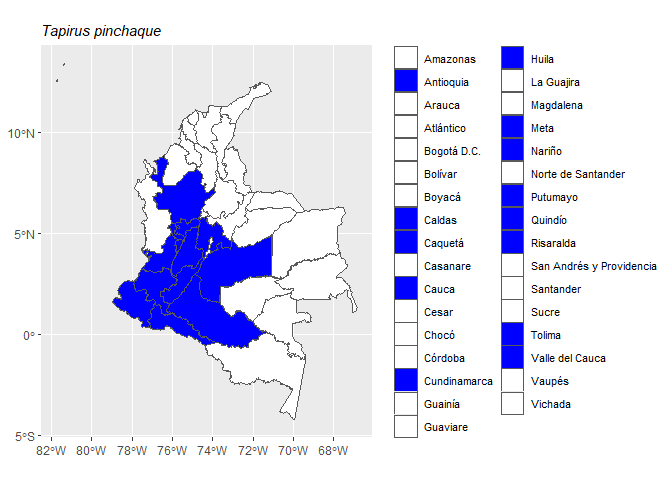

<!-- README.md is generated from README.Rmd. Please edit that file -->

# mammalcol 

<!-- badges: start -->

[](https://github.com/dlizcano/mammalcol/actions/workflows/R-CMD-check.yaml)
[](https://app.codecov.io/gh/dlizcano/mammalcol?branch=main)
[](https://CRAN.R-project.org/package=mammalcol)
<!-- badges: end -->

The goal of mammalcol is to allow easy access to the List of Mammal
Species of Colombia.

## Installation

You can install the development version of mammalcol from
[GitHub](https://github.com/mammalcol) with:

``` r
# install.packages("devtools")
devtools::install_github("dlizcano/mammalcol")
```

## Example

### Search database

This is a basic example which shows you how to search mammal names in
Colombia using a vector of mammal names.

``` r
# define a vector with species to search for
splist <- c("Tapirus bairdii", "Tapirus pinchaque", "Tapirus terrestris",
           "Tapirus terrestris",  "Pudu mephistophiles", "Tapirus bairdii")

# search in database
search_mammalcol(splist)
#> The following names are repeated in the 'splist': Tapirus bairdii, Tapirus terrestris
#>        name_submitted  kingdom   phylum    class          order    family
#> 1     Tapirus bairdii Animalia Chordata Mammalia Perissodactyla Tapiridae
#> 2   Tapirus pinchaque Animalia Chordata Mammalia Perissodactyla Tapiridae
#> 3  Tapirus terrestris Animalia Chordata Mammalia Perissodactyla Tapiridae
#> 4 Pudu mephistophiles Animalia Chordata Mammalia   Artiodactyla  Cervidae
#>     genus specificEpithet taxonRank scientificNameAuthorship
#> 1 Tapirus         bairdii   Especie             (Gill, 1865)
#> 2 Tapirus       pinchaque   Especie           (Roulin, 1829)
#> 3 Tapirus      terrestris   Especie         (Linnaeus, 1758)
#> 4    Pudu  mephistophiles   Especie        (de Winton, 1896)
#>               taxonRemarks
#> 1    Elevación (m): 0-1000
#> 2 Elevación (m): 1400-4000
#> 3    Elevación (m): 0-2400
#> 4 Elevación (m): 3000-3500
#>                                                                                                                                                                                                                                                           bibliographicCitation
#> 1                                                              HERSHKOVITZ P. 1954. Mammals of northern Colombia. Preliminary report No. 7: Tapirs (genus Tapirus), with a systematic review of American species. Proceedings of the United States National Museum 103:465-496.
#> 2                                                              ARIAS-ALZATE A, CC DOWNER, C DELGADO-V y J SÁNCHEZ-LONDOÑO. 2010. Un registro de tapir de montaña (Tapirus pinchaque) en el norte de la Cordillera Occidental de Colombia. Mastozoología Neotropical 17:111-116.
#> 3 ARIAS-ALZATE A, JA PALACIO VIEIRA y J MUÑOZ-DURAN. 2009. Nuevos registros de distribución y oferta de hábitat de la danta colombiana (Tapirus terrestris colombianus) en las tierras bajas del norte de la Cordillera Central (Colombia). Mastozoología Neotropical 16:19-25.
#> 4                                                                                                                                        ALBERICO M, A CADENA, JI HERNÁNDEZ-CAMACHO y Y MUÑOZ-SABA. 2000b. Mamíferos (Synapsida: Theria) de Colombia. Biota Colombiana 1:43-75.
#>   inMDD                                 Col_redlist
#> 1     1 EN A2cd+ B1ab (i,ii,iii)+ B2ab (i, ii, iii)
#> 2     1                                     EN A4cd
#> 3     1                                     VU A4cd
#> 4     1       EN A2cd B1ab (i; ii; iii; iv; v) \r\n
#>                                                                                                                                                                           distribution
#> 1                                                                                                                                                          Antioquia | Chocó | Córdoba
#> 2                                              Antioquia | Cauca | Cundinamarca | Huila | Meta | Nariño | Quindío | Risaralda | Tolima | Valle del Cauca | Caldas | Caquetá | Putumayo
#> 3 Antioquia | Amazonas | Arauca | Caquetá | Cauca | Cesar | Córdoba | Guainia | La Guajira | Meta | Magdalena | Vaupés | Vichada | Guaviare | Casanare | Norte de Santander | Putumayo
#> 4                                                                                                              Cauca | Huila | Nariño | Risaralda | Quindío | Tolima | Valle del Cauca
#>                                                         source endemic
#> 1 Proceedings of the United States National Museum 103:465-496      No
#> 2                         Mastozoología Neotropical 17:111-116      No
#> 3                           Mastozoología Neotropical 16:19-25      No
#> 4                                     Biota Colombiana 1:43-75      No
#>             english_name Distance
#> 1 Central American Tapir       12
#> 2         Mountain Tapir       14
#> 3          Lowland Tapir       16
#> 4          Northern Pudu       17
```

`mammalcol` has the ability to correct minor typos and lower case in the
genus.

``` r
# vector with species names and intentional typos
splist <- c("Tapiru terrestre", "pudu mephistophiles", "tapirus bairdii")

# search in database
search_mammalcol(splist)
#>        name_submitted  kingdom   phylum    class          order    family
#> 1    Tapiru terrestre Animalia Chordata Mammalia Perissodactyla Tapiridae
#> 2 Pudu mephistophiles Animalia Chordata Mammalia   Artiodactyla  Cervidae
#> 3     Tapirus bairdii Animalia Chordata Mammalia Perissodactyla Tapiridae
#>     genus specificEpithet taxonRank scientificNameAuthorship
#> 1 Tapirus      terrestris   Especie         (Linnaeus, 1758)
#> 2    Pudu  mephistophiles   Especie        (de Winton, 1896)
#> 3 Tapirus         bairdii   Especie             (Gill, 1865)
#>               taxonRemarks
#> 1    Elevación (m): 0-2400
#> 2 Elevación (m): 3000-3500
#> 3    Elevación (m): 0-1000
#>                                                                                                                                                                                                                                                           bibliographicCitation
#> 1 ARIAS-ALZATE A, JA PALACIO VIEIRA y J MUÑOZ-DURAN. 2009. Nuevos registros de distribución y oferta de hábitat de la danta colombiana (Tapirus terrestris colombianus) en las tierras bajas del norte de la Cordillera Central (Colombia). Mastozoología Neotropical 16:19-25.
#> 2                                                                                                                                        ALBERICO M, A CADENA, JI HERNÁNDEZ-CAMACHO y Y MUÑOZ-SABA. 2000b. Mamíferos (Synapsida: Theria) de Colombia. Biota Colombiana 1:43-75.
#> 3                                                              HERSHKOVITZ P. 1954. Mammals of northern Colombia. Preliminary report No. 7: Tapirs (genus Tapirus), with a systematic review of American species. Proceedings of the United States National Museum 103:465-496.
#>   inMDD                                 Col_redlist
#> 1     1                                     VU A4cd
#> 2     1       EN A2cd B1ab (i; ii; iii; iv; v) \r\n
#> 3     1 EN A2cd+ B1ab (i,ii,iii)+ B2ab (i, ii, iii)
#>                                                                                                                                                                           distribution
#> 1 Antioquia | Amazonas | Arauca | Caquetá | Cauca | Cesar | Córdoba | Guainia | La Guajira | Meta | Magdalena | Vaupés | Vichada | Guaviare | Casanare | Norte de Santander | Putumayo
#> 2                                                                                                              Cauca | Huila | Nariño | Risaralda | Quindío | Tolima | Valle del Cauca
#> 3                                                                                                                                                          Antioquia | Chocó | Córdoba
#>                                                         source endemic
#> 1                           Mastozoología Neotropical 16:19-25      No
#> 2                                     Biota Colombiana 1:43-75      No
#> 3 Proceedings of the United States National Museum 103:465-496      No
#>             english_name Distance
#> 1          Lowland Tapir       15
#> 2          Northern Pudu       17
#> 3 Central American Tapir       12
```

### Produce a map

The function mammalmap produces basic a map of distribution at the
“Departamento” level for a single species.

``` r
# write a species name in the function to map it
mammalmap("Tapirus pinchaque")
```



### See the full taxon table

``` r

head(taxon)
#>             scientificName  kingdom   phylum    class        order   family
#> 1       Passalites murelia Animalia Chordata Mammalia Artiodactyla Cervidae
#> 2            Mazama rufina Animalia Chordata Mammalia Artiodactyla Cervidae
#> 3 Passalites sanctaemartae Animalia Chordata Mammalia Artiodactyla Cervidae
#> 4            Mazama temama Animalia Chordata Mammalia Artiodactyla Cervidae
#> 5            Mazama zamora Animalia Chordata Mammalia Artiodactyla Cervidae
#> 6             Mazama zetta Animalia Chordata Mammalia Artiodactyla Cervidae
#>        genus specificEpithet taxonRank scientificNameAuthorship
#> 1 Passalites         murelia   Especie        J. A. Allen, 1915
#> 2     Mazama          rufina   Especie         (Pucheran, 1851)
#> 3 Passalites   sanctaemartae   Especie      (J. A. Allen, 1915)
#> 4     Mazama          temama   Especie             (Kerr, 1792)
#> 5     Mazama          zamora   Especie        J. A. Allen, 1915
#> 6     Mazama           zetta   Especie             Thomas, 1913
#>               taxonRemarks
#> 1     Elevación (m): 0-900
#> 2 Elevación (m): 1500-4000
#> 3     Elevación (m): 0-900
#> 4      Elevación (m): 0-68
#> 5  Elevación (m): 600-1200
#> 6 Elevación (m): 1600-1950
#>                                                                                                                                                                    bibliographicCitation
#> 1 ALLEN JA. 1916. List of mammals collected in Colombia by the American Museum of Natural History expeditions, 1910-1915. Bulletin of the American Museum of Natural History 35:191-238.
#> 2                                                 ALBERICO M, A CADENA, JI HERNÁNDEZ-CAMACHO y Y MUÑOZ-SABA. 2000b. Mamíferos (Synapsida: Theria) de Colombia. Biota Colombiana 1:43-75.
#> 3 ALLEN JA. 1916. List of mammals collected in Colombia by the American Museum of Natural History expeditions, 1910-1915. Bulletin of the American Museum of Natural History 35:191-238.
#> 4  GROVES C y P GRUBB. 1987. Relationships of living deer. Pp. 21-59, en: Biology and management of the Cervidae (CM Wemmer, ed.). Smithsonian Institution Press, Washington, D.C., USA.
#> 5 ALLEN JA. 1916. List of mammals collected in Colombia by the American Museum of Natural History expeditions, 1910-1915. Bulletin of the American Museum of Natural History 35:191-238.
#> 6 ALLEN JA. 1916. List of mammals collected in Colombia by the American Museum of Natural History expeditions, 1910-1915. Bulletin of the American Museum of Natural History 35:191-238.
#>   inMDD   Col_redlist
#> 1     0          <NA>
#> 2     1 VU A2 cde\r\n
#> 3     0          <NA>
#> 4     1            DD
#> 5     0            DD
#> 6     0            DD
#>                                                                                                                                                              distribution
#> 1                                                                                 Amazonas | Caquetá | Cauca | Meta | Vaupés | Vichada | Nariño | Putumayo | Cundinamarca
#> 2 Antioquia | Boyacá | Caldas | Cauca | Cesar | Cundinamarca | Huila | Nariño | Norte de Santander | Quindío | Risaralda | Santander | Tolima | Valle del Cauca | Caquetá
#> 3                                                                                           Bolívar | Cesar | La Guajira | Magdalena | Atlántico | Córdoba | Cundinamarca
#> 4                                                                                                                                                       Chocó | Magdalena
#> 5                                                                                                                          Amazonas | Caquetá | Meta | Putumayo | Vichada
#> 6                                                                                                          Antioquia | Caldas | Cauca | Nariño | Valle del Cauca | Tolima
#>                                                                                                                         source
#> 1                                                                Bulletin of the American Museum of Natural History 35:191-238
#> 2                                                                                                     Biota Colombiana 1:43-75
#> 3                                                                Bulletin of the American Museum of Natural History 35:191-238
#> 4 Pp. 21-59, en: Biology and management of the Cervidae (CM Wemmer, ed.). Smithsonian Institution Press, Washington, D.C., USA
#> 5                                                                Bulletin of the American Museum of Natural History 35:191-238
#> 6                                                                Bulletin of the American Museum of Natural History 35:191-238
#>   endemic        english_name
#> 1      No                <NA>
#> 2      No  Little Red Brocket
#> 3      No                <NA>
#> 4      No Mexican Red Brocket
#> 5      No                <NA>
#> 6      No                <NA>
```
