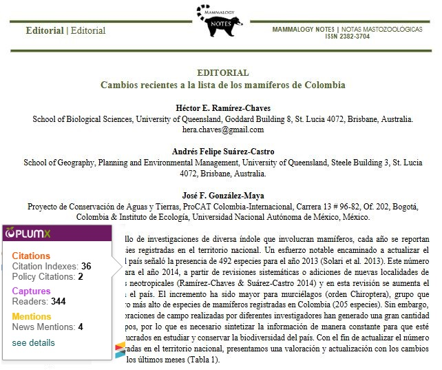
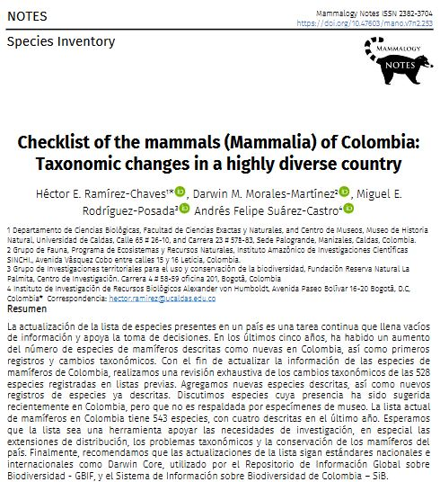
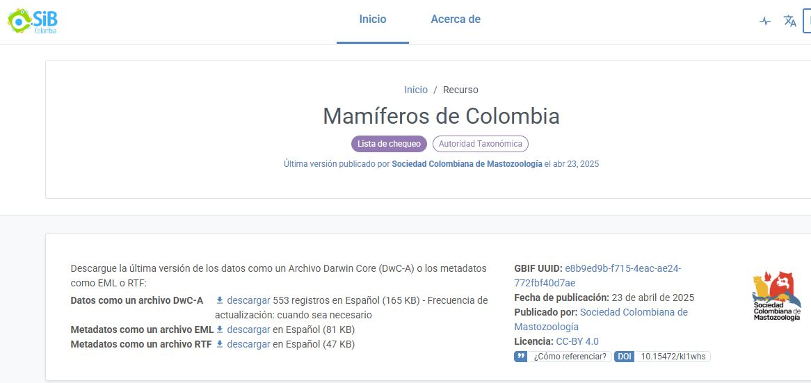
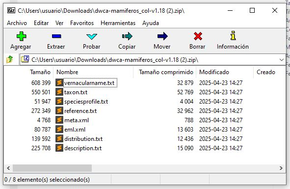
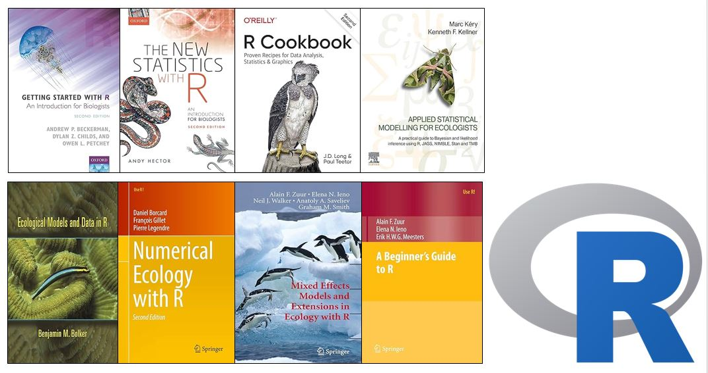
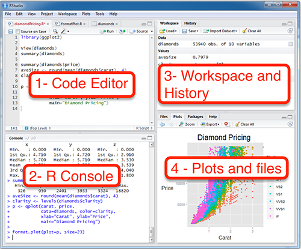

## Colombia un pais Megadiverso

- Número uno en Aves
- Número uno en Palmas
- Segundo en anfibios 
- Segundo en peces (agua dulce) 

- y los mamíferos?  

- Colombia, a pesar de ser un ícono de biodiversidad, no aparece entre los cinco primeros lugares del planeta en diversidad de mamíferos, según el Mammal Diversity Database de la American Society of Mammalogists (ASM, 2023). 

## El número de especies de mamíferos ha ido cambiando


::: {.columns}

::: {.column width="55%" .fragment}
Hace 10 años 500 especies.  


:::

::: {.column width="45%" .fragment}
En 2021, 543 especies.  


:::

:::

## Un recurso Darwin Core Archive (DwC-A) del SiB Colombia




## Un archivo comprimido con 8 archivos de texto



## Contenido de la presentación 

1. Que es mammalcol ?
2. Como surge mammalcol ?
3. Por que un paquete de R ?
4. Algunos casos de uso


## Que es mammalcol ?


El objetivo de mammalcol es permitir un fácil acceso al **Listado de Especies de Mamíferos de Colombia**

## Como surge mammalcol ?


Un proyecto colaborativo entre socios de la SCMas

## Por que un paquete de R ?

### Que es R?



R es ampliamente usado en Biología y Ecología. R es sofware libre y es muy poderoso!

## Por que un paquete de R ?

### Que es un paquete de R?


::: {.columns}

::: {.column width="55%" .fragment}

Los paquetes R son extensiones que contienen código, datos y documentación en un formato estandarizado que los usuarios de R pueden instalar, a través de un repositorio de software centralizado (CRAN).

:::

::: {.column width="45%" }


:::

:::


## Como se instala mammalcol?



```{r}
#| eval: false
#| echo: true

install.packages("mammalcol")

```

## Ejemplo de uso 1

Cargar el paquete

```{r}
#| eval: true
#| echo: true
library(mammalcol)
```

Hagámos una busqueda sencilla con una especie

```{r}
#| eval: true
#| echo: true

search_mammalcol("Tapirus terrestris")
```


## Ejemplo de uso 1

Hagámos una busqueda sencilla con una especie mal escrita. 

```{r}
#| eval: true
#| echo: true

search_mammalcol("Tapirus terrestre")
```


## Ejemplo de uso 1

Hagámos un mapa de la distribución por departamentos.

```{r}
#| eval: true
#| echo: true
mammalmap ("Tapirus terrestris")
```

::: {.callout-tip}
## En una próxima versión:

Esperamos incorporar mapas de distribución por municipio!
:::


## Ejemplo de uso 1

Hagamos el mapa de otra especie... 

```{r}
#| eval: true
#| echo: true
#| error: true
mammalmap ("Gorilla gorilla")
```


## Ejemplo de uso 2

Listados de especies por departamentos. En este caso todos los mamíferos de dos departamentos.

```{r}
#| eval: true
#| echo: true
#| error: true
sp_by_depto (c("Arauca", "Norte de Santander"), type = "any")
```


## Ejemplo de uso 2

Listados de especies exclusivas de ese departamento

```{r}
#| eval: true
#| echo: true
#| error: true
sp_by_depto(c("Norte de Santander"), type = "only")
```


## Ejemplo de uso 2

Listados de especies de algún grupo por departamento.  


Todos los murcielagos de Arauca y Norte de Santander.


```{r}
#| eval: true
#| echo: true
#| error: true
sp_by_depto(c("Arauca", "Norte de Santander"), type = "all", taxa = "Chiroptera")
```

## Ejemplo de uso 3

Validar datos de especies de mamíferos en usando coordenadas geográficas.
 
Usemos una tabla con varios registros y guardemolo en `validated_data`

```{r}
#| eval: true
#| echo: true
#| error: true
validated_data <- mamm_coords_validator(test_data_coordiantes, sp_names = "species")
```

20 records were evaluated. The evaluation results are in the "validation_result" column as follows:

0 = Valid species but not in Colombia. 1 = Valid species and coordinates. 2 = Valid species and coordinates in the ocean. 3 = Valid species and coordinates off the limits of the ocean. Review the location manually. 4 = Not valid species.  Try `search_mammalcol()` to fix typos on species names.

## Ejemplo de uso 3

Validar datos de especies de mamíferos en usando coordenadas geográficas.
 
### Veamos el resultado de `validated_data`

```{r}
#| eval: true
#| echo: true
#| error: true
(validated_data[,c("species", "validation_result")])
```

## Para quien pude ser de utilidad mammalcol ?


- Entusiastas de los mamíferos 
- Consultores, estudios de impacto ambiental.
- Preparar listados de especies y datos Darwin Core

## Gracias!

# Preguntas?